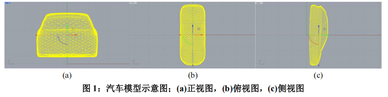

# 基于 KAN 网络的汽车风阻预测问题研究

## 摘要

传统汽车风阻预测依赖耗时高的流体仿真，而深度学习中的算子学习可替代传统流
体仿真，通过几何特征直接预测风阻场，解决效率与泛化瓶颈。本文通过对 KAN 模型
进行改进，建立了 KAN- Transformer-TA 模型，旨在突破几何拓扑泛化限制，为汽车外
形优化提供实时仿真能力。

对于问题一，本文首先详细介绍了算子学习以及其核心模型架构，为后续问题的解
决奠定基础。其次利用梯度下降算法，求解目标函数的最小参数 值，并利用图像法验
证。最后利用 Python 编程求解，可得求解的方程在第 2587 次迭代后收敛，得出最小参
数 的值为 0.567143。

对于问题二，本文简化了赛题数据的提取过程，并对数据进行了处理。首先利用主
成分分析压缩冗余信息，对数据降维。其次利用 Python 中的 plyfile 库读取 PLY 文件，
并加载 NPY 文件以此构建双模式解析器。然后通过计算每个三角形面元的几何中心坐
标对数据进行增强。再通过 Min-Max 归一化与 Z-score 标准化对提取出的数据进行处
理。最后基于飞桨深度学习框架，通过 Python 编程实现了多进程异步加载器，并且实测
数据的吞吐量较单线程模式提升 3.8 倍。

对于问题三，本文构建了 KAN- Transformer-TA 模型。首先本文详细介绍了 KAN
模型与 Transformer 模型的结构与原理。然后发现 Transformer 有着并行能力不足与无
法长期建立上下文依赖这两个问题。最后针对这两个问题，对三重注意力机制(TA) 的
通道、空间和时间三个注意力分支进行改进，以此将 TA 引入 Transformer 模型。

对于问题四，本文对问题三中建立的模型进行训练，并对汽车风阻进行预测。首先
我们介绍了实验环境和超参设置，然后确定以均方根误差(RMSE)、平均绝对误差(MAE)
和决定系数(R2
)作为模型的评价指标。其次针对风阻预测任务的多目标特性，构建了模
型的损失函数。再通过稀疏采样率和训练集规模这两个对比实验，得出模型虽资源占用
略高但泛化性强的特性。最后再通过修改神经网络超参数得出模型参数的最优配置。

对于问题五，本文首先定义了神经算子层一般形式，以此将连续积分形式的神经算
子离散化为求和形式。然后再将核函数参数化，令核函数显式依赖输入的数据。最后将
将参数化的核函数代入离散化的神经算子表达式，由此我们发现 Transformer 自注意力
机制的表达式与代入核函数的神经算子表达式形式相同，由此可以得出 Transformer 的
注意力机制是神经算子层的一个特例。

对于模型的分析与检验部分，本文首先通过灵敏度分析验证了模型参数与输入扰动
的鲁棒性。其次通过无关结构注入实验检验模型的容错能力，结果显示在引入额外点云
时误差仍满足工业级精度阈值。最后我们进行泛化实验表明，模型在飞行器气动数据集
上经微调后压力场 L2 误差降至 0.045，验证了其多场景适应能力。

最后本文还对模型进行了评价、改进与推广，以期为其他跨学科复杂场景下的应用
添砖加瓦。

关键词：算子学习；KAN 网络；Transformer；三重注意力机制；鲁棒性检验；泛化实验

## 问题背景

随着汽车和航空航天工业的快速发展，空气动力学性能优化成为提升载具效率与性
能的核心挑战。空气阻力(风阻)直接影响能源消耗与行驶稳定性，其预测通常依赖于计
算流体力学(CFD)仿真。传统方法需通过复杂的 Navier-Stokes 方程[1]求解，依赖高性能
计算集群，单次仿真耗时可达数小时甚至数天，严重制约了设计迭代速度。尤其在车辆
几何形态多变的情况下，传统方法难以满足实时优化的需求，亟需一种高效、高精度的
替代方案。
近年来，深度学习技术为风阻预测提供了新范式。通过构建科学机器学习(SciML)中
的算子学习[2]模型，可直接从几何特征映射到物理场分布，实现秒级预测。然而，现有
模型在几何拓扑泛化性上存在显著局限，当车辆形态超出训练分布时，预测误差急剧上
升。本竞赛以 3D ShapeNet Car 数据集为基础，涵盖 1256 种车辆模型的几何与压力场数
据，旨在构建高泛化能力的神经算子模型，突破传统仿真与现有 AI 模型的瓶颈。

## 问题提出

- 问题 1：基于梯度优化方法，探究如何通过调整神经网络的学习参数，最小化特定
指数与对数组合形式的损失函数。初始参数设定为较大值(θ=100)，需通过数学推导
或数值计算寻找使目标函数全局最小的参数解，为后续算子学习的优化策略提供理
论验证。
- 问题 2：针对高雷诺数湍流下的汽车风阻数据，需从复杂三维几何模型中提取关键
物理场标签(如表面压力分布)与几何特征(如节点坐标)，结合飞桨框架设计高效的数
据预处理流程。重点解决多源异构数据的标准化、异步加载与批量处理，构建适配
深度学习模型训练的数据管道，支撑后续神经算子的端到端学习。
- 问题 3：设计并实现基于科学机器学习的神经算子架构，如融合物理约束的 PINN、
傅里叶神经算子等，通过飞桨框架搭建从几何输入到物理场输出的映射模型。需在
有限算力资源下完成基线模型调优、训练推理流程验证，并在竞赛平台提交代码与
结果，验证模型在风阻预测任务中的泛化能力与计算效率。
- 问题 4：系统性评估算法在计算复杂度、显存占用及预测精度间的平衡关系，通过
调整输入稀疏性、训练集规模及网络超参数，探索模型性能边界。最终需在全量测试数据上实现压力场预测相对误差低于 0.4、阻力系数误差小于 80 个 counts 的工业
级精度目标，为实际工程应用提供量化依据。
- 问题 5：从算子学习的数学框架出发，分析 Transformer 模型中注意力机制与神经算
子层的内在关联，通过理论推导证明注意力机制可视为神经算子在特定参数化形式
下的特例，揭示其在函数空间映射中的普适性与局限性，为模型结构创新提供理论
支撑。
